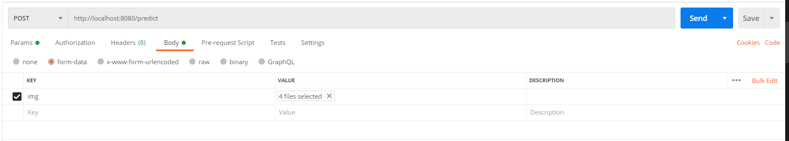
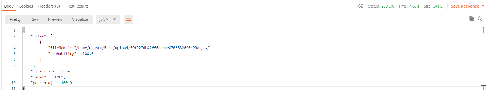

# Detección de Incendios (Back)

Servidor diseñado para probar el modelo creado de una red neuronal convolucional que se encargua de analizar y clasificar imágenes de los distintos lugares de una vivienda, de tal manera que se logra detectar patrones que indiquen un posible incendio. Mientras este en ejecución, cada request que se le haga y detecte un incendio, llegará una notificación al aplicativo movil.

# Link de la web

```sh
http://3.83.206.123:8080/predict
```

# Pre-requisitos

- Python 3.8
- Pip 20.0.2

# Instalación

1. Clone el repo.

```sh
git clone https://github.com/DeteccionDeIncendios/Back.git
```

2. Instale Backend packages.

```sh
cd front
sudo pip3 install -r requirements.txt
```

# Ejecución

1. Ejecute:

```sh
flask run --host=0.0.0.0 --port=8080
```

2.  Pruebe en postaman:

```sh
http://localhost:8080/
```

# Uso

El Backend está diseñado en flask, con la siguiente ruta:

```sh
http://localhost:8080/predict
```

Este endpoint recibe una o varias imágenes, las procesa y devuelve una lista con todas aquellas que se detectó fuego junto con su probabilidad.

Ejemplo de entrada en postman:



Ejemplo de salida:



En este ejemplo se cargan 4 imágenes de las cuales una se detectó fuego con una probabilidad de 100%.
